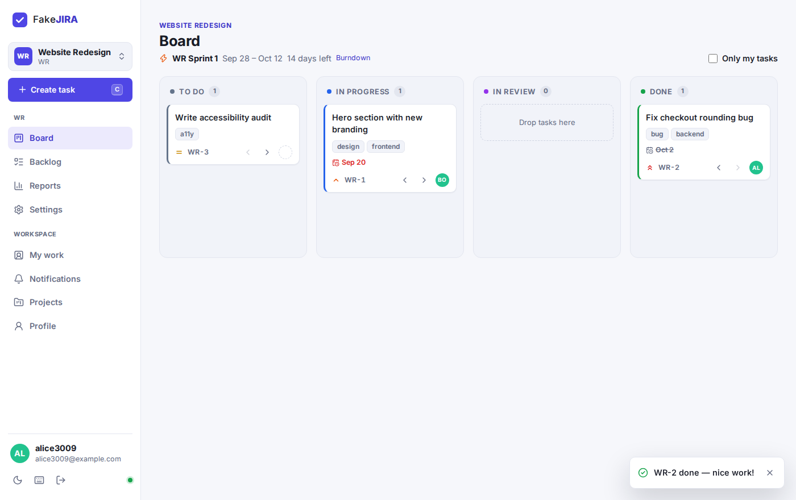
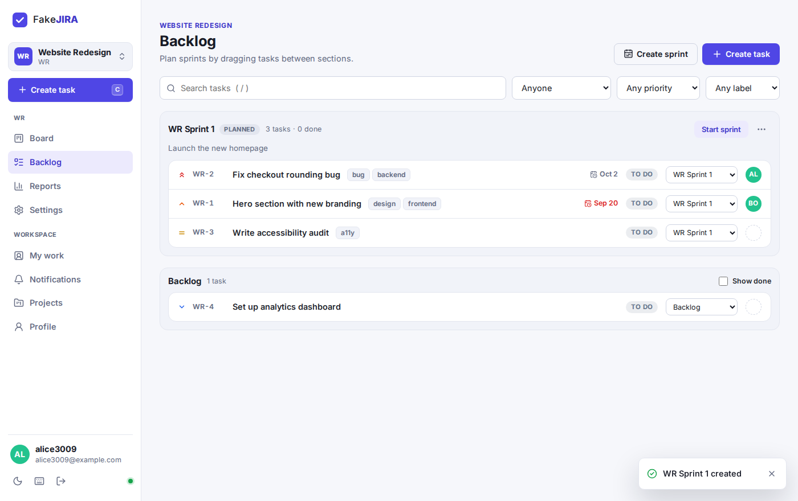
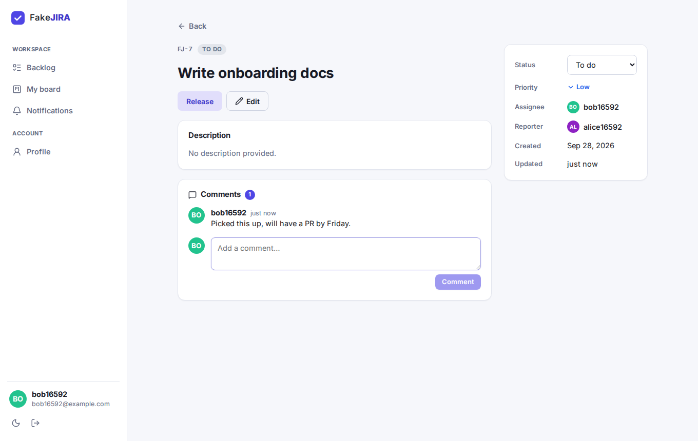
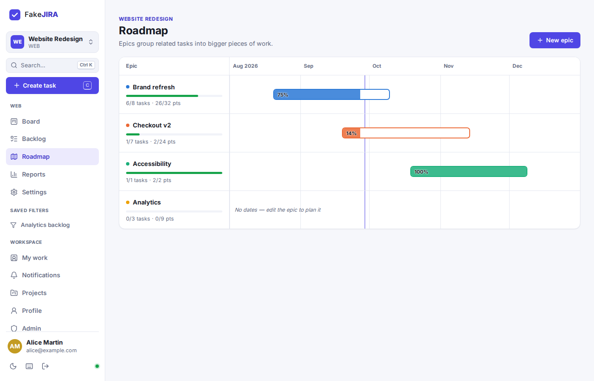
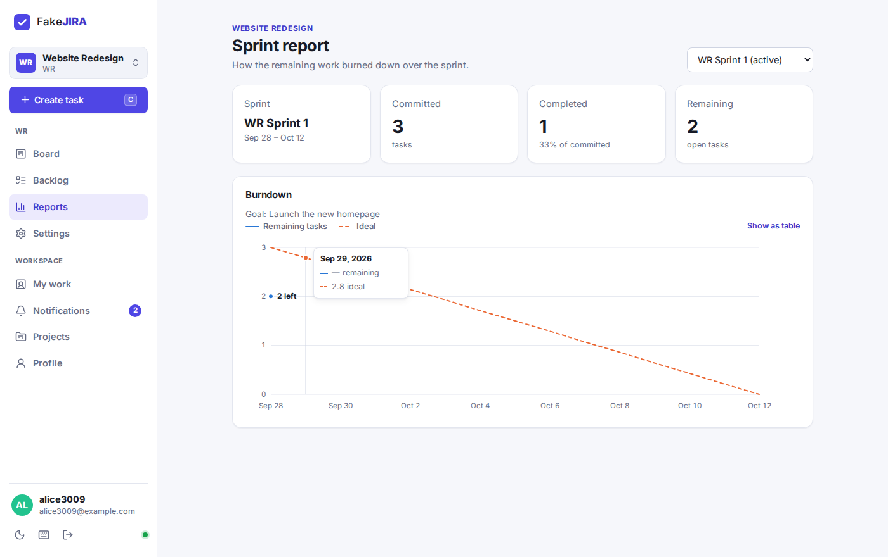
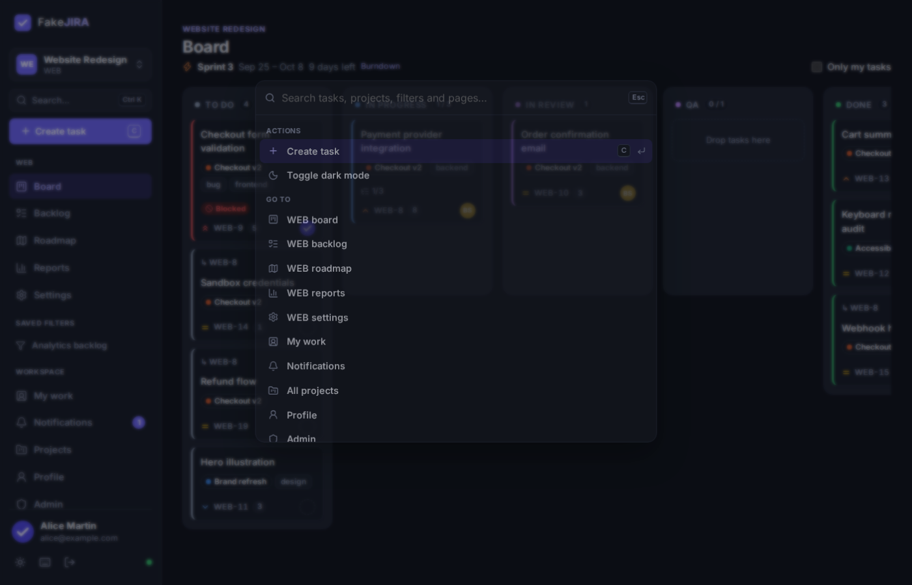
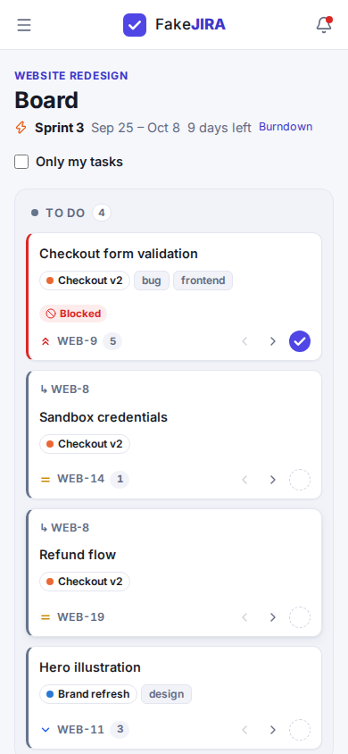

# FakeJIRA

A lightweight, Jira-style task tracker for small teams, built for a university course.
Version 2.0 replaced the original Android + Firebase app with a **Spring Boot** REST API and a **React** web frontend; 3.0 adds planning, team and integration features.



| Backlog & bulk edit | Task detail | Roadmap | Velocity | Command palette | Mobile |
| --- | --- | --- | --- | --- | --- |
|  |  |  |  |  |  |

## Features

**Projects and planning**
- **Projects** each have their own members, backlog, board and task keys (`WEB-1`, `API-7`, …). The owner manages members and settings. Members can leave.
- **Sprints**: plan work in the backlog by dragging tasks into a sprint (or use the dropdown), start it with dates, and complete it. Unfinished tasks go back to the backlog.
- **Board** for the active sprint (or every task if none is running), with drag and drop, an "only my tasks" filter, due dates, labels and checklist progress on cards.
- **Custom board columns** per project: rename, reorder, add columns (e.g. "QA" and "Code review" both mapping to In review) and set **WIP limits** — a column turns red when it holds too many cards.
- **Story points** on tasks, a **burndown** in tasks or points, and a **velocity chart** (committed vs. completed points for the last 10 sprints, with average velocity and say/do ratio).
- **Epics and roadmap**: group tasks into epics with start and due dates, see progress and a month-by-month timeline.
- **Reports**: burndown, velocity and a **time report** (hours per person and per task for any date range).
- **My work**: everything assigned to you across projects, with overdue tasks first.

**Tasks**
- Assign to any project member, or accept a task yourself.
- **Due dates**, with overdue and due-soon highlighting.
- **Labels**, with autocomplete and filtering.
- **Checklists** with a progress bar.
- **Markdown** in descriptions and comments, with a live preview. Raw HTML is not rendered.
- **@mentions** in comments, with autocomplete; mentioned members get notified.
- **Attachments** (up to 10 MB each): drag and drop to upload, with image previews. Files are always served as downloads.
- **Activity history**, e.g. "changed status from To do to In progress".
- **Subtasks** with progress, and **links** between tasks (blocks / relates to / duplicates). Tasks blocked by an unfinished task get a "Blocked" badge everywhere.
- **Time tracking**: log work like `1h 30m` with a date and note.
- **Watch** any task to be notified about its changes (commenters start watching automatically).

**Finding and changing things fast**
- **Command palette** (`Ctrl/⌘ K`): jump to any task by key or title, project, page or saved filter, or run an action.
- **Saved filters**: backlog filters live in the URL; save them (private or shared with the project) and they appear in the sidebar.
- **Bulk edit**: select tasks in the backlog (shift-click for ranges) and change status, assignee, sprint, priority, epic or labels at once, or delete them.
- **CSV export and import** from project settings.

**Staying up to date**
- **Live updates**: boards, backlogs, tasks and notification badges refresh by themselves when someone else changes something (server-sent events).
- **Notifications** in the app, **by email** (instantly, or as a **daily or weekly digest**) and as **browser push notifications**.
- **Installable app (PWA)**: add FakeJIRA to your phone's home screen or install it from the desktop browser.
- **GitHub integration**: mention task keys like `WEB-12` in commits, branches or pull requests and they appear on the task; optionally a merged pull request moves its tasks to Done.
- **Keyboard shortcuts**: `c` to create a task, `/` to search, `Ctrl/⌘ K` for the command palette, `g b` / `g k` / `g o` / `g r` / `g m` / `g n` / `g p` to jump to board, backlog, roadmap, reports, my work, notifications and projects, and `?` for help.

**Accounts**
- Register and sign in with a username or email. Passwords are hashed with BCrypt, and the API uses JWT bearer tokens.
- **Password reset** by email: single-use links, valid for one hour.
- **Profile pictures and display names.**
- **Project roles**: owner, member and **viewer** (read-only; viewers can still comment and watch).
- **Sign-up control**: open, **admin approval** or **invite-only**, switchable on the Admin page. Admins and project owners create invite links.
- **Rate limiting** of sign-in, sign-up and password reset.
- **Admin page**: sign-up mode, pending accounts, admins, invites and **backups**.
- Light and dark themes, and a responsive layout for phones.

## Tech stack

| Layer | Stack |
| --- | --- |
| Backend | Java 17+, Spring Boot 3.5 (Web, Data JPA, Security, OAuth2 Resource Server/JWT, Validation), H2 database |
| Frontend | React 19, TypeScript, Vite, React Router, react-markdown, lucide icons |

## Project layout

```
backend/    Spring Boot API (Maven)
frontend/   React single-page app (Vite)
docs/       Screenshots
```

## Running locally

Prerequisites: JDK 17 or newer, Maven 3.9+, Node.js 20+.

**1. Start the backend** (on http://localhost:8080):

```bash
cd backend
mvn spring-boot:run
```

Data is stored in an H2 file database at `backend/data/`.

**2. Start the frontend** (on http://localhost:5173) in a second terminal:

```bash
cd frontend
npm install
npm run dev
```

Open http://localhost:5173 and create an account. The Vite dev server proxies `/api` to the backend.

### Single-jar build

You can bundle the React app into the Spring Boot jar and serve everything from one port:

```bash
cd frontend && npm install && npm run build:backend
cd ../backend && mvn package
java -jar target/fake-jira-3.0.0.jar      # http://localhost:8080
```

## Running with Docker

The multi-stage `Dockerfile` builds the frontend and the backend and produces one small JRE image. The image runs as a non-root user and stores its H2 database in the `/data` volume.

Inside the container the app listens on port 8080. The compose file publishes it only on the host's loopback interface, on port **8081** by default, so it won't clash with another service already using 8080.

```bash
cp .env.example .env
# Set APP_JWT_SECRET in .env (e.g. openssl rand -base64 48); change FAKEJIRA_PORT if 8081 is taken
docker compose up -d --build
```

Updating: `git pull && docker compose up -d --build`. Your data stays in the `fakejira-data` volume.

### Behind Caddy

See [`deploy/Caddyfile.example`](deploy/Caddyfile.example) and add one site block to your existing Caddyfile.

- **Caddy installed on the host:** use `docker compose up -d` as above and set `reverse_proxy 127.0.0.1:8081`.
- **Caddy running in Docker** (for example in another compose project): attach FakeJIRA to Caddy's network and don't publish a host port.

  ```bash
  # CADDY_NETWORK in .env = the network your Caddy container is on (see `docker network ls`)
  docker compose -f docker-compose.yml -f docker-compose.caddy.yml up -d --build
  ```

  Then use `reverse_proxy fakejira:8080` in the Caddyfile. This override needs Docker Compose v2.24 or newer.

### Configuration

| Setting | Env var | Default |
| --- | --- | --- |
| `app.jwt.secret` | `APP_JWT_SECRET` | Random on each start. Set a value of 32+ characters so logins survive restarts. |
| `app.jwt.validity` | `APP_JWT_VALIDITY` | `12h` |
| `app.base-url` | `APP_BASE_URL` | Empty. The public URL (e.g. `https://jira.example.com`) used for links in emails and invites. When empty, the address an admin opens the app at is used; set it anyway so links are right from the start. |
| `app.storage.dir` | `APP_STORAGE_DIR` | `./data/attachments` (`/data/attachments` in Docker) |
| `spring.datasource.url` | `SPRING_DATASOURCE_URL` | `jdbc:h2:file:./data/fakejira` |
| `app.backup.dir` | `APP_BACKUP_DIR` | `./data/backups` (`/data/backups` in Docker) |
| `app.backup.cron` | `APP_BACKUP_CRON` | `0 30 3 * * *` (03:30 every night). `-` turns scheduled backups off. |
| `app.backup.keep` | `APP_BACKUP_KEEP` | `14` backups kept |
| `app.digest.cron` | `APP_DIGEST_CRON` | `0 0 7 * * *`. Daily digests go out then; weekly ones on Mondays. |
| `app.registration.default-mode` | `APP_REGISTRATION_DEFAULT_MODE` | `OPEN`. Initial sign-up mode (`OPEN`, `APPROVAL`, `INVITE`) until an admin changes it. |
| `app.rate-limit.enabled` | `APP_RATE_LIMIT_ENABLED` | `true` |
| `app.rate-limit.client-ip-headers` | `APP_RATE_LIMIT_CLIENT_IP_HEADERS` | `CF-Connecting-IP,X-Forwarded-For`. Set it empty if the app is reachable without your proxy. |
| `app.push.subject` | `APP_PUSH_SUBJECT` | Contact for push services; defaults to the base URL. |
| – | `TZ` | `UTC`. Time zone for backups and digests, e.g. `Europe/Budapest`. |
| `spring.mail.host` | `SPRING_MAIL_HOST` | Empty, so email is off. Also set `SPRING_MAIL_PORT`, `SPRING_MAIL_USERNAME`, `SPRING_MAIL_PASSWORD` and `APP_MAIL_FROM`. For an SMTP relay without login, set `SPRING_MAIL_SMTP_AUTH=false`. |

**Email is optional.** Without SMTP, the email toggle in profiles is disabled. Password reset links are then written to the server log instead (`docker logs fakejira`), so an administrator can pass them on.

### Admins, sign-up and invites

The **first account** ever created is the administrator (after upgrading, the oldest account becomes one). Admins see **Admin** in the sidebar, where they choose who can sign up:

- **Open** — anyone can create an account.
- **Admin approval** — new accounts wait until an admin approves them on the Admin page.
- **Invite only** — only people with an invite link can sign up.

Invite links work in every mode and are valid for 7 days. Admins create them on the Admin page; project owners create them in **Project settings → Invite links** (the new user joins that project). If an email address is given, the invite only works for it and is emailed when SMTP is configured.

Sign-in (10/min), sign-up (5/h) and password reset (5/h) are limited per client IP, and failed sign-ins per account (20 per 15 min). Clients get `429` with a `Retry-After` header.

### Backups and restore

A zip with the database, attachments and profile pictures is written every night to `/data/backups` (inside the data volume); the newest 14 are kept. Admins can make one on demand and download backups from the Admin page — keep a copy off the server.

To restore:

```bash
docker compose stop fakejira
docker run --rm -v fake-jira_fakejira-data:/data -v "$PWD":/restore alpine sh -c \
  'cd /tmp && unzip -o /restore/fakejira-backup-XXXX.zip && unzip -o database.zip -d /data \
   && rm -rf /data/attachments /data/avatars && cp -r attachments /data/ 2>/dev/null; cp -r avatars /data/ 2>/dev/null; chown -R 100:101 /data'
docker compose start fakejira
```

(`docker volume ls` shows the exact volume name; `100:101` is the `app` user of the image — check with `docker compose exec fakejira id`.)

### GitHub integration

As the project owner open **Project settings → GitHub → Connect a repository**. In the GitHub repository go to **Settings → Webhooks → Add webhook**, paste the payload URL and secret shown, pick content type `application/json` and the **Pushes** and **Pull requests** events. Task keys in commit messages, branch names and pull request titles/bodies then link commits and PRs to tasks (shown under *Development* on the task). Turn on *Move tasks to Done when a pull request is merged* to close tasks automatically. Deliveries are verified with the `X-Hub-Signature-256` HMAC.

### Push notifications and installing the app

Each user turns on push in **Profile → Push notifications** (per device). This needs HTTPS (fine behind Caddy/Cloudflare). On iPhone/iPad, first add FakeJIRA to the home screen (Share → Add to Home Screen), then enable push from the installed app. Keys for push (VAPID) are generated on first use and stored in the database.

### Upgrading

**From 2.x to 3.0:** deploy the new version on your existing database; the schema is updated automatically. The oldest account becomes admin, email notification settings carry over, and existing projects get the default four board columns. Make sure `APP_BACKUP_DIR` points into the data volume (the Dockerfile sets `/data/backups`).

**From 2.0:** just deploy the new version on your existing database. On first start, all existing tasks move into a project called **FakeJIRA** (key `FJ`) and keep their `FJ-<number>` keys. Every existing user becomes a member of it. Logins stay valid if `APP_JWT_SECRET` is unchanged.

## Tests

```bash
cd backend && mvn test          # API integration tests (projects, sprints, roles, epics, time, GitHub, push crypto, backups, rate limits, upgrade)
cd frontend && npm run build    # type-check + production build
```

GitHub Actions runs the backend tests, the frontend build and a Docker build on every push and pull request (`.github/workflows/ci.yml`).

## API overview

All endpoints except register, login and password reset need an `Authorization: Bearer <token>` header.

| Method | Path | Description |
| --- | --- | --- |
| POST | `/api/auth/register`, `/api/auth/login` | Create an account or sign in; returns `{ token, user }` |
| POST | `/api/auth/forgot-password`, `/api/auth/reset-password` | Email a reset link / set a new password with the link's token |
| GET | `/api/auth/me` | Current user |
| GET / POST | `/api/projects` | My projects / create a project (`{ key, name, description }`) |
| GET / PUT / DELETE | `/api/projects/{key}` | Read, update or delete (owner) a project |
| POST / DELETE | `/api/projects/{key}/members[/{userId}]` | Add a member by username or email / remove a member or leave |
| GET | `/api/projects/{key}/labels` | Labels used in the project |
| GET / POST | `/api/projects/{key}/sprints` | List or create sprints |
| PUT / DELETE | `/api/sprints/{id}` | Edit or delete (planned only) a sprint |
| POST | `/api/sprints/{id}/start`, `/api/sprints/{id}/complete` | Start or complete a sprint |
| GET | `/api/sprints/{id}/burndown` | Burndown data points |
| GET | `/api/tasks?project=&scope=AVAILABLE\|MINE\|REPORTED\|ALL&q=&priority=&status=&label=&sprint=<id>\|backlog&assignee=<id>\|me\|none` | List and search tasks in your projects |
| POST | `/api/tasks` | Create a task (`projectKey`, `title`, `description`, `priority`, `dueDate`, `labels`, `assigneeId`, `sprintId`) |
| GET / PUT / DELETE | `/api/tasks/{id}` | Read, update, or delete (reporter or project owner) |
| PATCH | `/api/tasks/{id}/status` | Change status |
| PUT | `/api/tasks/{id}/assignee`, `/api/tasks/{id}/sprint` | Assign (`null` unassigns) / move to a sprint (`null` = backlog) |
| POST | `/api/tasks/{id}/accept`, `/api/tasks/{id}/release` | Take or give back a task |
| GET / POST | `/api/tasks/{id}/comments` | List or add comments (`@username` mentions notify) |
| GET / POST / PATCH / DELETE | `/api/tasks/{id}/checklist[/{itemId}]` | Checklist items |
| GET | `/api/tasks/{id}/activity` | Task history |
| GET / POST | `/api/tasks/{id}/attachments` | List or upload (`multipart/form-data`, field `file`) |
| GET / DELETE | `/api/attachments/{id}/content`, `/api/attachments/{id}` | Download or delete a file |
| GET | `/api/events` | Server-sent event stream of live changes |
| GET | `/api/users?q=` | Username search (for adding members) |
| GET | `/api/notifications`, `/api/notifications/unread-count` | Notifications |
| POST | `/api/notifications/{id}/read`, `/api/notifications/read-all` | Mark as read |
| GET / PUT | `/api/profile`, `/api/profile/settings`, `/api/profile/password` | Profile, display name and email frequency, password change |
| POST / DELETE | `/api/profile/avatar` | Upload (PNG/JPEG/GIF/WebP, 2 MB) or remove your profile picture |
| PUT | `/api/projects/{key}/members/{userId}/role` | Change a member's role (`MEMBER` / `VIEWER`) |
| GET / POST · PUT / DELETE | `/api/projects/{key}/epics` · `/api/epics/{id}` | Epics |
| GET / POST · PUT / DELETE · POST | `/api/projects/{key}/columns` · `/api/columns/{id}` · `/api/columns/{id}/move?direction=` | Board columns |
| GET | `/api/projects/{key}/velocity`, `/api/projects/{key}/time?from=&to=` | Velocity and time reports |
| GET / POST · DELETE | `/api/projects/{key}/filters` · `/api/filters/{id}` | Saved filters |
| GET · POST | `/api/projects/{key}/export.csv` · `/api/projects/{key}/import` | CSV export / import (`multipart`, field `file`) |
| POST | `/api/tasks/bulk` | Bulk change (`taskIds` plus the change) |
| GET / POST / DELETE | `/api/tasks/{id}/links`, `/api/tasks/{id}/time`, `/api/tasks/{id}/watch` | Links, time entries, watching |
| GET | `/api/tasks/{id}/subtasks`, `/api/tasks/{id}/dev`, `/api/tasks/key/{key}` | Subtasks, GitHub links, lookup by key |
| GET / POST / PUT / DELETE | `/api/projects/{key}/github` | GitHub webhook settings (owner) |
| POST | `/api/integrations/github/{key}` | GitHub webhook endpoint |
| GET / POST / DELETE | `/api/invites` | Invite links |
| GET / PUT / POST / DELETE | `/api/admin/...` | Admin: sign-up mode, users, backups |
| GET · POST / DELETE | `/api/push/key` · `/api/push/subscribe` | Web push |

## Contact

If you have trouble building the project, email erosbalint3@proton.me.
